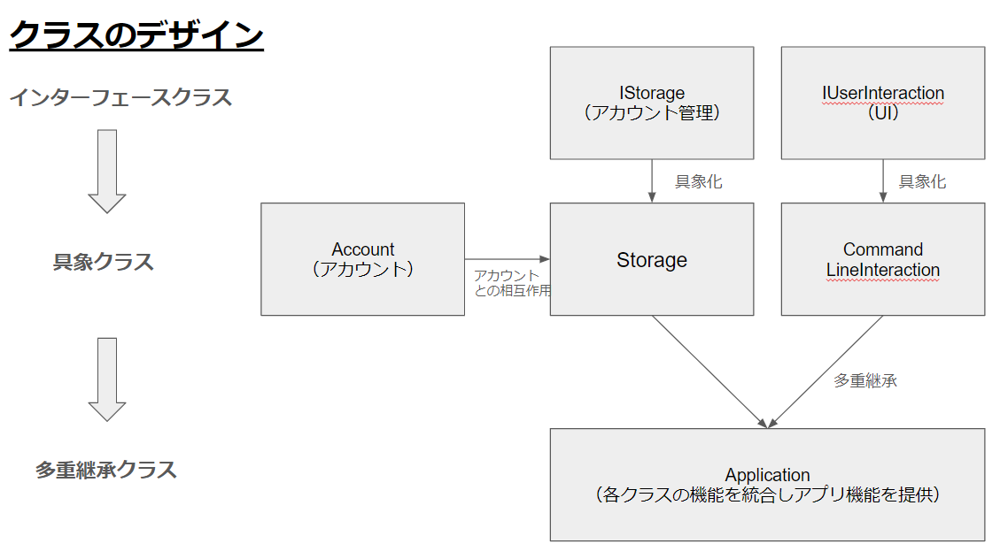

# 銀行アカウント管理システム

## セットアップと実行の手順

1. **Pythonのインストール**:
    - [Python公式サイト](https://www.python.org/downloads/)からインストールしてください。

2. **プロジェクトのクローンまたはダウンロード**:
    - リポジトリをクローンまたはダウンロードしてください。
    ```
    https://github.com/sadanobu-mizusako/python-02-project-ja
    ```

3. **プログラムの実行**:
    - 以下のコマンドでプログラムを実行します。
    ```bash
    python main.py
    ```

## プロジェクトにおける重要な設計やその設計理由
### 重要な設計
- このプロジェクトは下のクラス図に基づき設計されています。
    - インターフェース使用要件（標準レベルの要件1）に則り、アカウント管理用の抽象クラスと、ユーザーインターフェース用の抽象クラスを作成しています。


### 設計理由
- インターフェース分離の原則:
    - 銀行システムの各機能を複数のインターフェースクラスに分離して実装することにより、機能拡張性、再利用性が改善することが期待されます。
    - 今後、銀行システムの機能を拡張し、アカウント管理、UI以外の機能（例えば、CRM：Curtomer Relation Management機能など）を追加する際、開発が容易になります。
- ポリモーフィズム：
    - 抽象基底クラスを継承してアカウント管理クラス、UIクラスを作成することにより、様々なバージョンの「アカウント管理クラス」、「UIクラス」を共通のインターフェースで扱えるようになります。
    - 例えば、この設計により、UIのABテスト（複数パターンのUIを出し分けてより、よりユーザーの反応が良いものを選ぶ）が効率的に行えるようになります。

## ツールまたはサービスの使い方 (ユーザー向け説明)

### アカウントの新規作成

1. プログラムを実行します。
2. "オプションを選択してください" というプロンプトが表示されるので、`2` を入力して新規アカウントの作成を選択します。
3. 名前、初期残高、パスワードを順に入力します。
4. アカウントが作成され`アカウントID`が表示されます。このIDはログアウト後にログインする際に必要です。
5. アカウント作成後はログイン後の操作選択画面に遷移します。

### ログイン

1. "オプションを選択してください" というプロンプトが表示されたら、`1` を入力して既存のアカウントにログインを選択します。
2. `アカウントID`を入力します。`アカウントID`はアカウント作成時に表示されたIDです。
3. 次にパスワードを入力し、認証を行います。
4. 認証に成功するとログインが完了します。

### 操作の選択

ログイン後、以下の操作が選択できます:

- `1`: 入金 - 入金する金額を入力します。
- `2`: 出金 - 出金する金額を入力します。
- `3`: 送金 - 送金先の`アカウントID`と送金額を入力します。
- `4`: ログアウト - 現在のアカウントからログアウトします。
- `5`: 解約 - 現在のアカウントを削除します。
- `6`: 口座情報 - `アカウントID`、ユーザー名、残高を表示します。

### システムの終了

ログアウト後、以下の選択肢が表示されます:

- `1`: システムを終了する
- `2`: 他のアカウントで操作を継続する

適切な操作を選んでシステムを終了するか、別のアカウントで操作を継続するかを選択します。

### デモ用アカウントの利用

スクリプトの開始時に、以下のデモ用アカウントが作成されます:
アカウントを作成せずにこれらのアカウント使用することができます。

- アカウントID：0, ユーザー名：mizusako, 残高: 1000, パスワード: password
- アカウントID：1, ユーザー名：tanaka, 残高: 1000, パスワード: password
- アカウントID：2, ユーザー名：mike, 残高: 1000, パスワード: password

